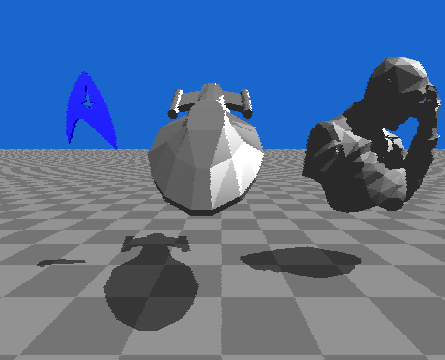
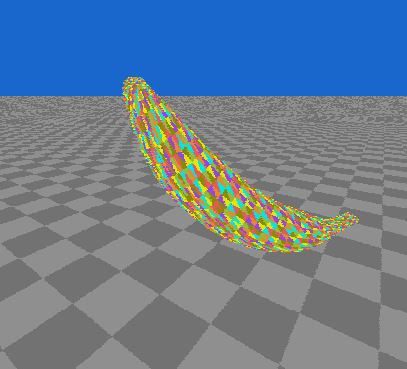
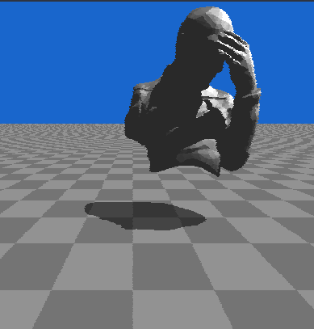

# x3d-parser

#### Parses xml-like .x3d files from tree structure into objects for use in ray tracing


### Showcase





### Process
```
* Import (or create) a model in Blender.
* Export model from Blender as .x3d with "Triangulate: True"
* Run .x3d file through x3d_parser.py and save output to a .mesh file
* Load .mesh file from within QT ray trace environment
```
